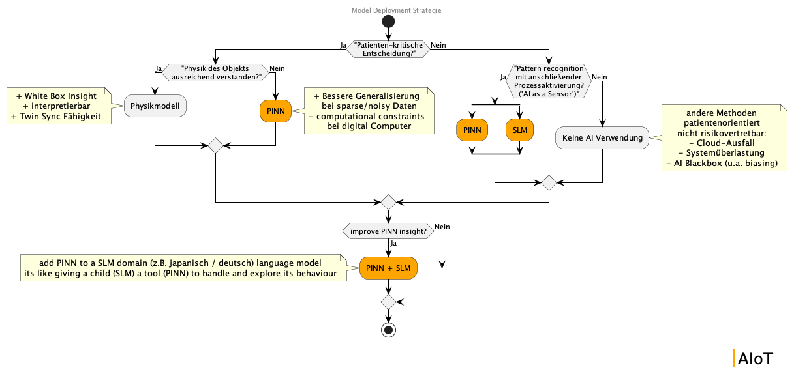

# Schwanensee

*Faust am Schwanensee - Sharing the tacit knowledge of experienced workers*

Creating a PINN softsensor, which adjusts the parameters of its underlying physical model.

What is this about? I want to recite Faust, Goethe for the answer:

<blockquote>
Der Erdenkreis ist mir genug bekannt.<br>
Nach drüben ist die Aussicht uns verrannt;<br>
Tor, wer dorthin die Augen blinzelnd richtet,<br>
Sich über Wolken seinesgleichen dichtet!
</blockquote>

This tension illustrates that a complete description of tissue or other physiological diagnostics may not be possible with our current methods, and therefore, we may resort to a hyperspace approach of the neural network, since its understanding of the system could differ from ours, which, however, could prove beneficial to us.

Let Faust sit on the Swan Lake (german: "Schwanensee")


## Usage

```bash
pip install deepxde tensorflow-probability tf-keras
```

```bash
python schwan/schwan.py --python --input example/limitCycle/generated/Goldbeter_1995.py
```

and then after this

```bash
pip install .
```

with

```bash
DDE_BACKEND=tensorflow python example/bumpyFlight/oscillator_lv2.py
DDE_BACKEND=tensorflow python example/lorenz/lorenz_lv2.py
DDE_BACKEND=tensorflow.compat.v1 python example/lorenz/lorenz_w_exogenous_stimulus.py
```

or as a starter a simple sine wave

```bash
DDE_BACKEND=tensorflow.compat.v1 python example/sine/sine.py
```

### Different Physio Sensai Model Levels

```lv1``` gets used, if the user does not have multiple data time series. For this case, the initial conditions are known and can get hardcoded into the physio physics models. This improves the speed of parameter fitting, but (because of the sparse amout of time series data) could find a not generally suitable parameter set.

```lv2``` gets used in the case, that the user has multiple data time series at hand. The initial conditions in this case are variable and an input into the PINN, while finding a suitable set of parameters for the physio model.


### ONNX Converter

```bash
python -m tf2onnx.convert --saved-model generalized_patient --output model.onnx
```

## Code Format

```bash
ruff format schwan
ruff check schwan
```

## Briefer about PINNs

[PINNs](https://maziarraissi.github.io/PINNs/) can be designed to solve two classes of problems:
- data-driven solution (forward problem)
- data-driven discovery (inverse problem)

of differential equations e.g. partical differential equations (PDE).

Here we implemented the **data-driven discovery** given noisy and incomplete measurements.
It is important to understand that the PDEs (that govern a given data-set), or in generell the xDEs, get embeded into the learning process of the NN.
Explicitly speaking, the PDEs get embeded into the cost function of the NN. This is done using the DeepXDE package.
With that, the embeded PDEs act as a regularization agent that limits the space of admissible solutions of the NN training.
The PINN alone does not find any unknown/missing terms of the PDE problem.
**It only adjusts the unknown PDE parameters** as part of its cost function.

### Medical AI Deployment Strategy (similar to the mission of the IAEA)


